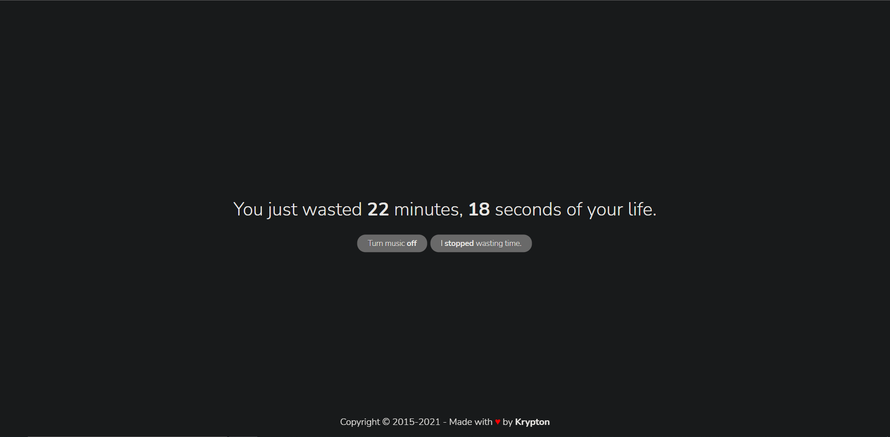
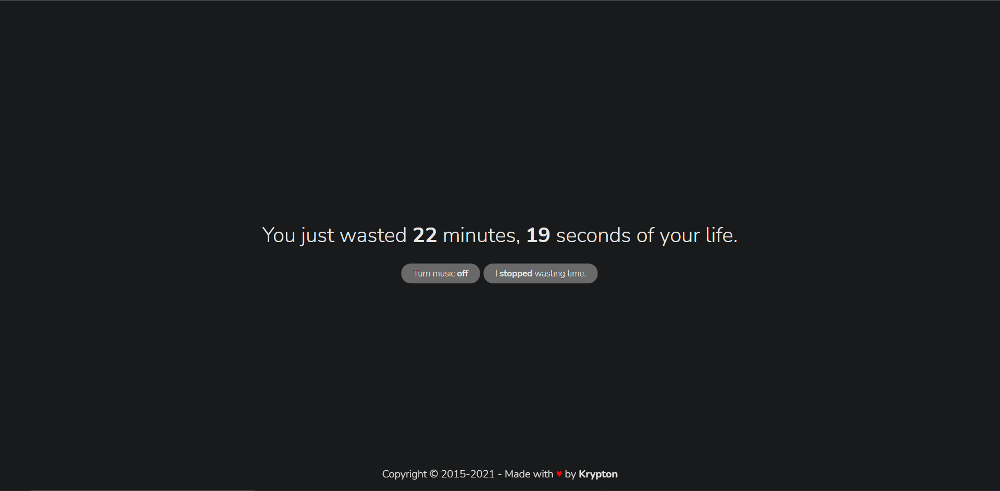

# 🕑 Time Wasted Counter 🕢

<p style="text-align: center">
  <a href="//discord.gg/mTBrXyWxAF"></a>
  <a href="//github.com/kkrypt0nn/time-wasted-counter/commits/main"></a>
  <a href="//github.com/kkrypt0nn/time-wasted-counter"></a>
  <a href="//github.com/kkrypt0nn/time-wasted-counter/issues"></a>
  <a href="//github.com/kkrypt0nn/time-wasted-counter/blob/main/LICENSE.md"></a>
</p>

This is a simple website that you can visit when you want to know for how long you're going to waste your time at doing
something.

Do not hesitate to give it a star ✨ if you like it.

## ❓ Support

If you need some help for something, do not hesitate to join my discord server [here](https://discord.gg/mTBrXyWxAF) or ask
in the [issues](https://github.com/kkrypt0nn/time-wasted-counter/issues) tab of this repository.

## 📂 Files Structure

```
.
├── assets
│   ├── css
│   │   └── style.css
│   ├── favicon.png
│   ├── js
│   │   └── core.js
│   └── music
│       ├── music.mp3
│       ├── music.ogg
│       └── music.wav
├── error.html
└── index.html

4 directories, 8 files
```

## 📜 F.A.Q

### Why have you made this?

I was myself interested to know how much time I waste at doing stuff, and the website I used to use isn't working
anymore and was not in dark theme 😎

### How does it look like?

Here's a screenshot of how the counter looks like:

Image:

<br>
Gif:



### Why is there no light theme?

I take care of the eyes of potential people that visits the website. If you want to make a light theme, feel free to do
so.

### Can I open pull requests and contribute?

You *can*, however it's highly doubtful that I will merge them.

### Can I copy and paste this on my website?

Yes! You will need to keep the copyright notice in the footer like the [LICENSE.md](LICENSE.md) says >.<<br>In case you
use it you can always give it a star 🌟

## © License

This project is licensed under the Apache License 2.0 - see the [LICENSE.md](LICENSE.md) file for details.
